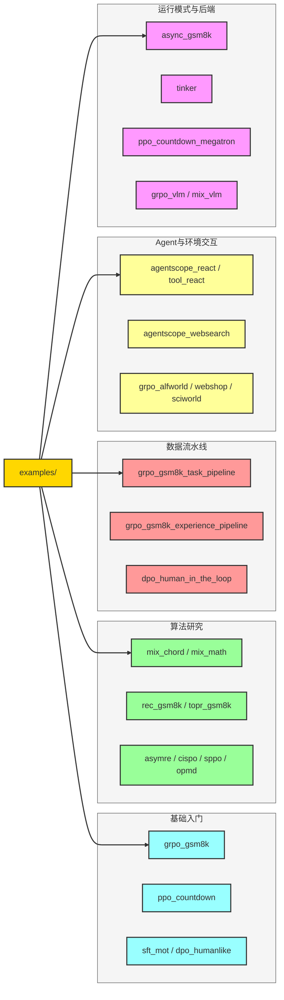
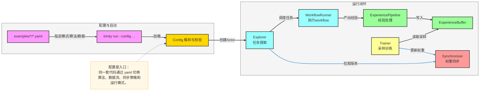
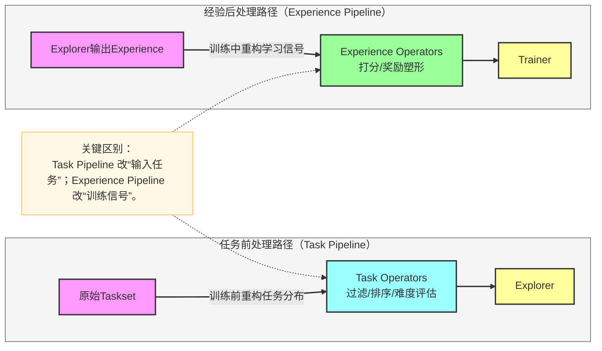
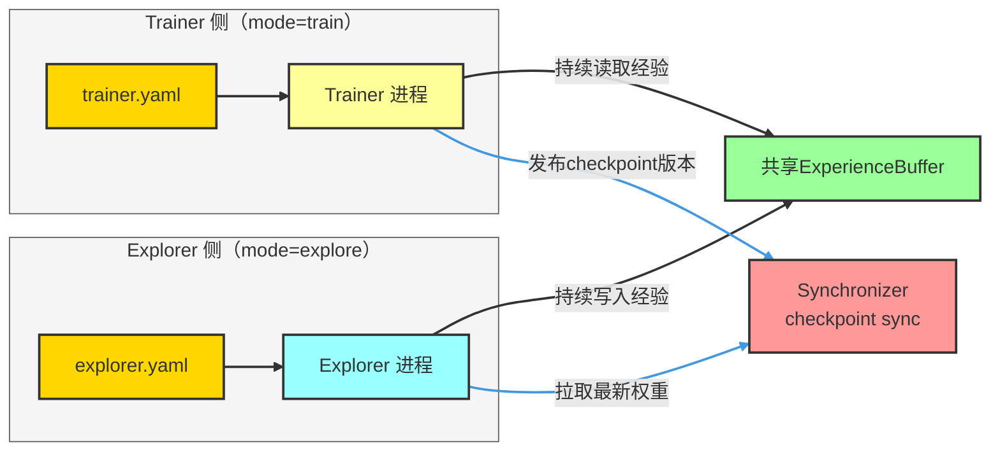

# Trinity-RFT `examples` 讲解与实践路线

> 目标：解释 `examples` 在项目中的作用、覆盖能力边界，以及如何按“从易到难”逐步上手。

---

## 1. `examples` 是什么

`examples` 是 Trinity-RFT 的“可运行能力地图”。  
每个子目录通常包含：

- 一份或多份 `yaml` 配置（定义训练模式、算法、数据、模型、同步策略）；
- 可选 `README.md`（场景说明、依赖、运行命令）；
- 可选脚本/工作流代码（用于数据准备、评估、定制 workflow）。

它不是简单的 demo 集合，而是把框架核心能力（算法、数据流水线、多轮 Agent、多模态、异步模式、后端切换）映射成可复现模板。

---

## 2. `examples` 分类总览（按能力）

---

## 3. 代表示例与用途

- `grpo_gsm8k`：最小主线示例，适合理解标准 `mode=both` 闭环。
- `async_gsm8k`：将 Explorer 与 Trainer 分离为两个配置（`explore` / `train`），用于异步训练。
- `grpo_gsm8k_task_pipeline`：演示 task pipeline 在训练前做任务筛选/重排。
- `grpo_gsm8k_experience_pipeline`：演示 experience pipeline 在训练中做奖励重塑。
- `mix_chord`：SFT+RL 混合算法实践，偏研究场景。
- `agentscope_websearch`：多轮 ReAct + 外部搜索工具，偏 Agentic workflow。
- `grpo_vlm`：视觉语言模型训练，偏多模态扩展。
- `tinker`：无 GPU 场景的后端替代方案（有功能边界）。
- `learn_to_ask` / `bots`：更完整的论文级实验模板（含数据准备和评估流程）。

---

## 4. 从 `yaml` 到训练闭环（关键流程）

---

## 5. 两种“数据增强”思路：Task Pipeline vs Experience Pipeline

---

## 6. 异步模式示例（`async_gsm8k`）关键流程

---

## 7. 推荐实践顺序（新同学）

1. 先跑 `grpo_gsm8k/gsm8k.yaml`，理解最小闭环；
2. 再跑 `grpo_gsm8k_task_pipeline` 与 `grpo_gsm8k_experience_pipeline`，理解数据处理位置差异；
3. 再看 `async_gsm8k`，理解生产/消费解耦；
4. 然后选择方向：
   - 算法方向：`mix_chord`、`rec_gsm8k`、`topr_gsm8k`
   - Agent 方向：`agentscope_websearch`、`grpo_alfworld`
   - 基础设施方向：`tinker`、`grpo_vlm`

---

## 8. 常见误区

- 只改算法参数，不核对 `buffer` 与 `synchronizer`，容易导致吞吐不匹配；
- 把 Task Pipeline 与 Experience Pipeline 混为一谈，导致调参方向错误；
- 异步模式下先停 Explorer，可能导致 Trainer 侧读取不足（建议按示例说明先启动 Trainer）；
- 没有从 `README` 补齐外部依赖（例如 AgentScope/MCP、Tinker API Key）。

