# Trinity-RFT 新同学 Onboarding 阅读顺序

> 目标：用最短路径建立对项目“能跑、能改、能扩展”的认知。

## 1. 建议阅读路径（先全局后细节）

1. `README_zh.md`：先理解项目定位、核心概念、运行方式；
2. `trinity/cli/launcher.py`：理解系统入口与运行模式分发；
3. `trinity/common/config.py`：理解配置对象与参数如何驱动各模块；
4. `trinity/explorer/explorer.py`：理解采样与经验生成主循环；
5. `trinity/buffer/pipelines/experience_pipeline.py`：理解经验处理与入库；
6. `trinity/trainer/trainer.py`：理解采样、训练、保存、同步；
7. `trinity/manager/synchronizer.py`：理解 Explorer/Trainer 协同机制；
8. `examples/*.yaml`：将代码结构映射到真实配置与运行场景。

## 2. 阅读顺序图（推荐）

```mermaid
flowchart LR
    %% 样式定义
    classDef docStyle fill:#f9f,stroke:#333,stroke-width:2px
    classDef entryStyle fill:#ffd700,stroke:#333,stroke-width:2px
    classDef coreStyle fill:#9ff,stroke:#333,stroke-width:2px
    classDef dataStyle fill:#9f9,stroke:#333,stroke-width:2px
    classDef syncStyle fill:#f99,stroke:#333,stroke-width:2px
    classDef cfgStyle fill:#ff9,stroke:#333,stroke-width:2px
    classDef subgraphStyle fill:#f5f5f5,stroke:#666,stroke-width:1px,rounded:10px

    subgraph layer1["阶段1：建立整体认知"]
        A[README_zh.md]:::docStyle
        B[launcher.py]:::entryStyle
        C[config.py]:::cfgStyle
    end
    class layer1 subgraphStyle

    subgraph layer2["阶段2：理解训练闭环"]
        D[explorer.py]:::coreStyle
        E[experience_pipeline.py]:::dataStyle
        F[trainer.py]:::coreStyle
        G[synchronizer.py]:::syncStyle
    end
    class layer2 subgraphStyle

    subgraph layer3["阶段3：落地与实操"]
        H[examples/*.yaml]:::cfgStyle
        I[trinity run --config ...]:::entryStyle
    end
    class layer3 subgraphStyle

    A --> B
    B --> C
    C --> D
    D --> E
    E --> F
    F --> G
    G --> H
    H --> I

    linkStyle 0,1,2,3,4,5,6,7 stroke:#333,stroke-width:2px,arrowheadStyle:filled
```

## 3. 每阶段学习目标

- 阶段1：知道系统解决什么问题、怎么启动、配置如何控制行为；
- 阶段2：能描述 Explorer -> Buffer -> Trainer -> Synchronizer 的闭环；
- 阶段3：能基于 `examples` 修改一个最小配置并跑通一次流程。

## 4. 首周建议任务（可执行）

- 跑通一个最小案例：`examples/tinker/tinker.yaml` 或 `examples/grpo_gsm8k/gsm8k.yaml`
- 将 `mode` 从 `both` 改为 `explore/train` 观察日志差异
- 在 `experience_pipeline` 增加一个简单 operator（如统计字段）并验证输出
- 跟踪一次权重同步时机（通过日志确认 sync interval 生效）

## 5. 常见卡点

- 环境依赖与后端选择（`vllm` / `tinker`）不匹配
- Ray 集群未正确启动导致 `trinity run` 失败
- 配置字段较多，建议先基于示例最小改动
- 训练步数、采样吞吐、同步间隔配置不协调导致“看似卡住”
