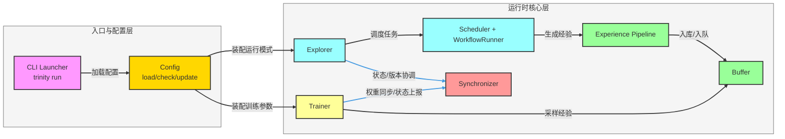
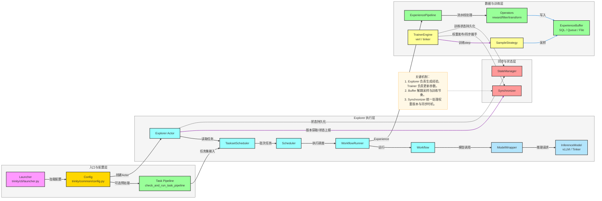

# Trinity-RFT 项目架构分析（基础版 + 详细版）

> 目标：帮助读者从“快速理解整体”到“深入理解实现”两层视角掌握 Trinity-RFT。

---

## 第一部分：基础版（功能架构版）

### 1. 项目定位

Trinity-RFT 是一个面向大语言模型强化微调（RFT, Reinforcement Fine-Tuning）的通用框架。  
它将训练流程拆分为三个协同模块：

- `Explorer`：负责任务探索与经验生成；
- `Buffer`：负责任务/经验数据的读写与流水线处理；
- `Trainer`：负责基于经验进行参数更新。

核心价值是将“采样、数据处理、训练、同步”解耦，使不同训练模式（同步/异步、on-policy/off-policy、在线/离线）可配置、可扩展。

### 2. 核心模块与职责

- `CLI & Config`：通过 `trinity run --config ...` 启动流程，装配运行模式与模块参数。
- `Explorer 模块`：调度任务、运行 workflow、调用推理模型、产生 experience。
- `Experience Pipeline`：对经验进行过滤/打分/转换等处理后写入缓冲区。
- `Buffer 模块`：作为 Explorer 与 Trainer 的数据桥梁，承接经验输入与训练采样输出。
- `Trainer 模块`：从 Buffer 采样，执行 train step，定期保存 checkpoint。
- `Synchronizer`：管理 Explorer 与 Trainer 的权重同步与运行状态协调。

### 3. 模块关系（基础版）

### 4. 核心流程（基础版）

1. CLI 读取配置并初始化 Ray 环境；
2. Explorer 拉取任务并执行 workflow，产出经验；
3. Experience Pipeline 处理经验后写入 Buffer；
4. Trainer 从 Buffer 采样并训练模型；
5. Synchronizer 在 Explorer 与 Trainer 之间协调权重版本和运行状态，形成闭环。

### 5. 技术栈（基础版）

- 分布式与并行：`ray`
- 训练与模型：`torch`、`transformers`、`verl`、`vllm`、`tinker`
- 配置与命令行：`omegaconf`、`typer`
- 服务与可视化：`fastapi`、`uvicorn`、`streamlit`
- 数据与存储：`datasets`、`sqlalchemy`

---

## 第二部分：详细版（模块关系版）

### 1. 详细模块分解

#### 1.1 入口与配置

- `trinity/cli/launcher.py`：统一入口，支持 `run/studio/debug/convert/log`。
- `trinity/common/config.py`：配置加载、校验、派生参数。
- `trinity/manager/config_manager.py`：Studio 配置管理与可视化生成。

#### 1.2 Explorer 子系统

- `trinity/explorer/explorer.py`：Explorer actor 生命周期、探索循环、评估、同步。
- `trinity/explorer/scheduler.py`：任务调度与并发执行。
- `trinity/explorer/workflow_runner.py`：将任务交给具体 workflow 执行。
- `trinity/common/workflows/*`：各类任务 workflow 与奖励逻辑实现。
- `trinity/common/models/*`：推理模型抽象与后端实现（vLLM/Tinker 等）。

#### 1.3 Buffer 与数据流水线

- `trinity/buffer/pipelines/task_pipeline.py`：taskset 预处理与任务流水线。
- `trinity/buffer/pipelines/experience_pipeline.py`：经验处理流水线（清洗、变换、反馈）。
- `trinity/buffer/*`：经验读写器、任务调度器、队列/SQL 等存储适配。

#### 1.4 Trainer 子系统

- `trinity/trainer/trainer.py`：训练主循环、采样、同步、保存 checkpoint。
- `trinity/trainer/verl/*` 与 `trinity/trainer/tinker/*`：训练引擎封装。
- `trinity/algorithm/*`：采样策略、优势函数、损失函数等算法组件。

#### 1.5 同步与状态管理

- `trinity/manager/synchronizer.py`：Explorer/Trainer 权重同步与状态协同。
- `trinity/manager/state_manager.py`：阶段状态、迭代进度、恢复点管理。

### 2. 模块关系与数据流（详细版）

### 3. 关键流程详解

#### 流程 A：标准训练闭环（`mode=both`）

1. Launcher 读取配置并 `ray.init`；
2. 运行 task pipeline（可选）；
3. 启动 Explorer 与 Trainer 两个 Ray Actor；
4. Explorer `prepare -> explore`，经 Scheduler/WorkflowRunner 生成经验；
5. ExperiencePipeline 处理经验并写入 Buffer；
6. Trainer 按 SampleStrategy 采样经验并执行 `train_step`；
7. 达到同步条件后，Trainer 与 Explorer 通过 Synchronizer 协调权重同步；
8. 循环执行直到达到总步数或任务结束。

#### 流程 B：服务化在线闭环（`mode=serve`）

1. Explorer 进入 serve 模式，启动 OpenAI 兼容代理服务；
2. 外部 Agent 通过 API 发起对话请求；
3. 服务记录响应并转为 experience；
4. 结合反馈后将经验提交至 experience pipeline；
5. pipeline 处理后写入训练输入，支持在线强化微调；
6. 服务后台持续拉取最新权重版本，维持在线模型更新。

### 4. 关键设计特点（详细版）

- **解耦架构**：Explorer / Buffer / Trainer 职责边界清晰，便于独立扩展。
- **多模式统一**：同一套框架支持离线、在线、同步、异步、服务化训练。
- **插件化扩展**：workflow、algorithm、operator 可替换，适配不同任务场景。
- **工程可运维**：支持 checkpoint、状态恢复、日志与监控，便于实验复现。

### 5. 快速上手建议（面向新同学）

1. 先阅读 `README_zh.md`，理解三大核心模块；
2. 再看 `trinity/cli/launcher.py`，把握整体启动链路；
3. 然后串读 `explorer.py`、`trainer.py`、`experience_pipeline.py`；
4. 最后结合 `examples/*.yaml` 跑通一个最小训练案例。

---

## 附：关键证据文件

- `README_zh.md`
- `pyproject.toml`
- `trinity/cli/launcher.py`
- `trinity/common/config.py`
- `trinity/explorer/explorer.py`
- `trinity/explorer/scheduler.py`
- `trinity/explorer/workflow_runner.py`
- `trinity/trainer/trainer.py`
- `trinity/manager/synchronizer.py`
- `trinity/buffer/pipelines/experience_pipeline.py`
- `trinity/buffer/pipelines/task_pipeline.py`
- `trinity/algorithm/`
- `examples/`
