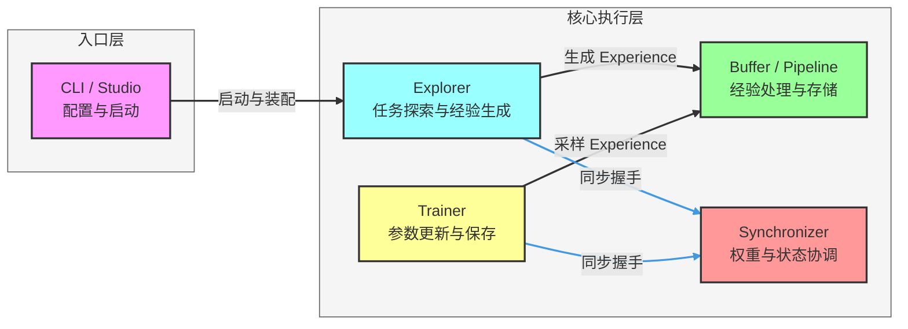

# Trinity-RFT 项目架构分析（汇报精简版）

> 用于项目评估、立项汇报、跨团队快速对齐（建议 3-5 分钟讲解）。

## 1. 项目一句话

Trinity-RFT 是一个面向大语言模型强化微调（RFT）的通用框架，通过 `Explorer + Buffer + Trainer` 三模块解耦，实现采样、数据处理与训练的可扩展协同。

## 2. 业务价值

- 支持在线/离线、同步/异步、on-policy/off-policy 多种训练模式
- 降低算法研发与应用团队的集成成本（模块可插拔）
- 兼顾研究灵活性与工程可运维性（checkpoint、状态恢复、监控）

## 3. 架构总览（精简）

## 4. 关键流程（30 秒版）

1. 按配置启动 Explorer 与 Trainer；
2. Explorer 执行任务并产出经验；
3. Buffer/Pipeline 清洗和组织经验；
4. Trainer 采样经验并更新模型；
5. Synchronizer 协调权重版本，进入下一轮闭环。

## 5. 技术栈（汇报口径）

- 分布式：`ray`
- 训练：`torch`、`transformers`、`verl`、`tinker`
- 推理：`vllm`（可选）
- 配置与入口：`omegaconf`、`typer`
- 服务与可视化：`fastapi`、`streamlit`

## 6. 风险与关注点

- 高并发下经验吞吐与训练消费速率匹配
- 同步策略（NCCL/Checkpoint/Memory）对稳定性和时延的影响
- 长周期训练中的状态恢复与实验复现一致性
